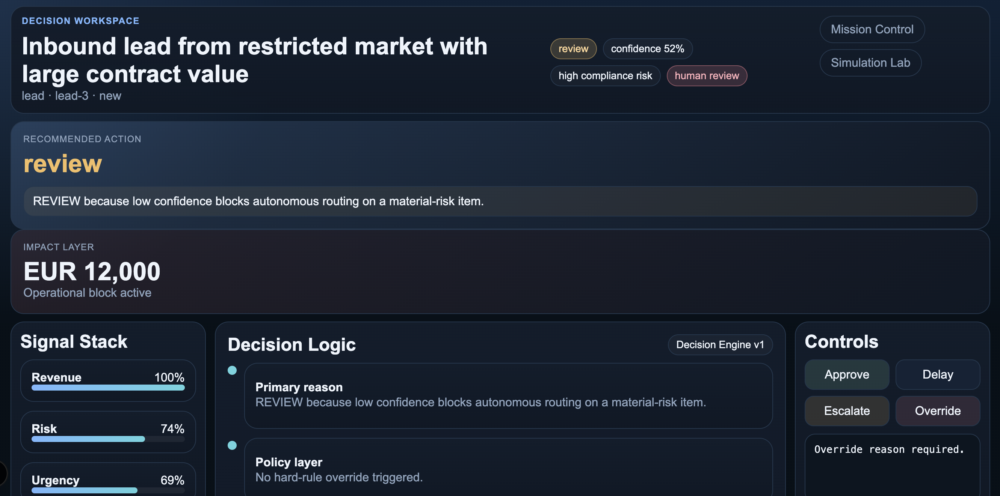
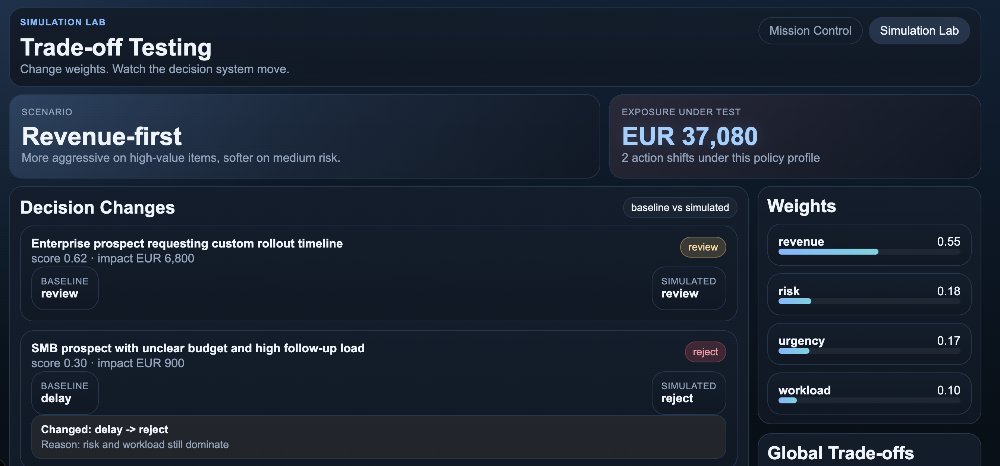
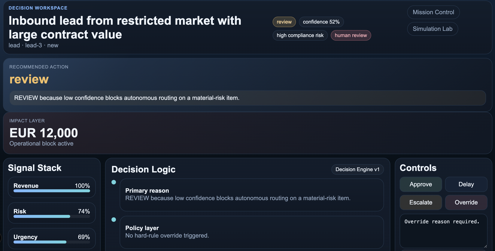

# Decision Room

AI decision workspace for high-risk operational cases.

Decision Room is a decision-support system designed for environments where business impact, risk, and time constraints must be balanced under pressure.

It models how organizations evaluate and act on high-stakes items across revenue, support, and compliance workflows.

## Problem

Critical operational decisions are often:

- slow to evaluate
- inconsistent across teams
- hard to justify and audit
- opaque when automated

This leads to:

- lost revenue
- compliance risk
- poor decision traceability

## What Makes This Different

Most tools manage data or display queues.

Decision Room models decision-making itself through:

- explicit trade-offs
- explainable outputs
- auditable decisions
- human and system collaboration

## Solution

Decision Room introduces a structured decision engine with:

- policy-based overrides
- weighted scoring across multiple signals
- full explainability for every decision
- human override with audit trail

## Core Concepts

### Decision Engine

Each item is evaluated through:

`policy layer -> weighted scoring -> human fallback`

Signals used:

- `revenue_score`
- `risk_score`
- `urgency_score`
- `workload_score`

All signals are normalized and combined using configurable weights.

### Explainability Layer

Every decision includes:

- signal breakdown
- policy triggers
- final score and threshold mapping
- rationale for the chosen action

Example:

```text
Revenue +0.40
Risk -0.08
Urgency +0.14
Workload -0.06

Final score: 0.68 -> REVIEW
Policy: none
```

### Human-in-the-Loop

- Low-confidence or high-risk cases require human review
- Any override requires justification
- All actions are recorded for auditability

### Simulation Lab

Simulation allows teams to test different strategies by adjusting weights:

- revenue-first
- risk-first
- balanced

It shows:

- decision changes
- baseline vs simulated outcomes
- global impact across revenue, risk, and review load

## Product Overview

### Mission Control (`/dashboard`)

- queue of high-stakes items
- exposure at risk (EUR)
- items requiring human review
- decision pressure across signals

### Decision Workspace (`/decisions/[id]`)

- full case context
- decision recommendation
- signal stack
- decision graph
- explainability breakdown
- human override controls

### Simulation Lab (`/simulation`)

- adjust signal weights
- observe decision shifts
- evaluate trade-offs across scenarios


## Screenshots

### Mission Control



### Simulation Lab



### Decision Workspace




## Architecture

Frontend:

- Next.js App Router
- React
- TypeScript

Backend:

- Next.js Route Handlers

Core modules:

- `scoring.ts` -> signal normalization
- `policies.ts` -> hard overrides
- `decision-engine.ts` -> final decision logic
- `dataset.ts` -> simulated multi-domain cases

## Dataset

The current dataset includes mixed decision scenarios across:

- revenue (leads)
- support (tickets)
- risk and compliance (cases)

Each item includes fields such as:

- `value_eur`
- `risk_score`
- `urgency_score`
- `confidence`
- `sla_hours`
- expected outcome

## Path to Production

This system is designed to evolve into:

- real-time ingestion from CRM, support, and finance systems
- LLM-based summarization and reasoning
- persistent audit logs with PostgreSQL
- multi-tenant architecture
- policy engine integration


## Live Demo

Add the Vercel URL here after deployment.

## Demo Script

1. This project models how companies make high-risk operational decisions across revenue, support, and compliance.
2. In most companies, these decisions are inconsistent, slow, and hard to audit.
3. I built a decision engine that combines policy constraints, weighted scoring, and human fallback.
4. In Mission Control, you see decision pressure and exposure. In the Decision Workspace, you see signals, scoring, policy hits, and final action.
5. In Simulation Lab, you can change strategy and see how decisions shift across the system.
6. The goal is not blind automation, but structured, explainable, auditable decision-making.
